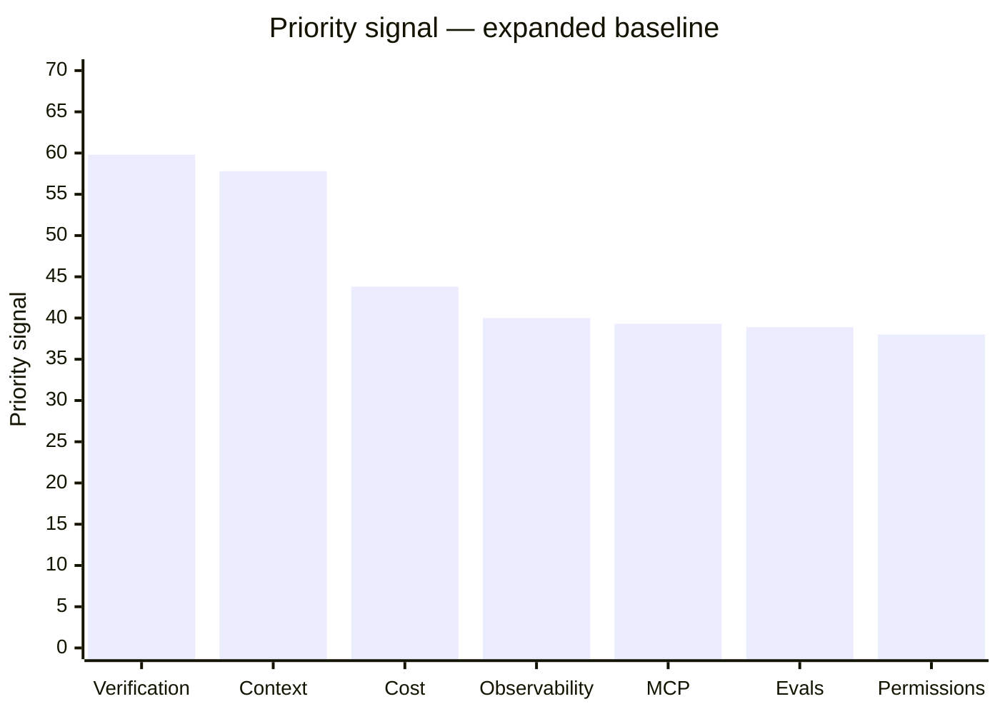
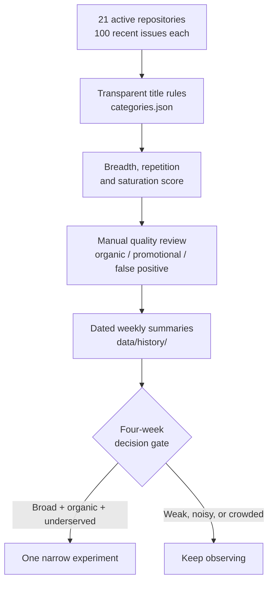

<div align="center">

# AI Needs Radar

**Evidence before implementation.** A transparent radar for recurring, cross-project needs in the AI ecosystem.

[](https://github.com/irina958-design/ai-needs-radar/actions/workflows/radar.yml)
[](https://www.python.org/)
[](LICENSE)

[Latest evidence](data/latest.md) · [Source coverage](data/source_coverage.md) · [Reviewed signals](data/reviewed_signals.csv) · [Decision gate](https://github.com/irina958-design/ai-needs-radar/issues/9)

</div>

## Executive Summary

- **The goal is to find broad, underserved AI-user needs before writing another product.** The radar separates evidence that a problem exists from evidence that the solution space still has room.
- **The current sample covers 2,100 recently updated issues across 21 repositories.** It includes coding agents, agent frameworks, local AI, assistant interfaces, RAG applications, infrastructure, evaluation, observability, and visual generation.
- **Context and session continuity is the most durable cross-segment signal so far.** Verification ranks slightly higher in the formula, but weakened after the sample expanded beyond developer tools. Neither result is yet sufficient to justify a standalone product.
- **The next product decision waits for four weekly snapshots.** If a need remains broad, organic, and insufficiently served, we build one narrow experiment; otherwise we document the no-build decision.

> A high radar score means **research this need next**. It does not mean **build this product now**.

## Current evidence

<table>
  <tr>
    <th>Repositories</th>
    <th>Recent issues</th>
    <th>Need categories</th>
    <th>Manually reviewed</th>
  </tr>
  <tr>
    <td align="center"><strong>21</strong></td>
    <td align="center"><strong>2,100</strong></td>
    <td align="center"><strong>7</strong></td>
    <td align="center"><strong>30</strong></td>
  </tr>
</table>

The baseline below uses the expanded sample collected on **22 July 2026**. Scores combine cross-repository breadth, repeated demand within repositories, issue volume, and solution saturation.



| Rank | Need | Matches | Repositories | Saturation | Signal |
|---:|---|---:|---:|---:|---:|
| 1 | Verification and evidence of completion | 114 | 20/21 | 3/5 | **59.8** |
| 2 | Context, memory, and session continuity | 212 | 20/21 | 4/5 | **57.8** |
| 3 | Cost, rate limits, and model routing | 118 | 20/21 | 5/5 | **43.8** |
| 4 | Observability, audit, and replay | 90 | 19/21 | 5/5 | **40.0** |
| 5 | MCP and tool interoperability | 148 | 18/21 | 5/5 | **39.3** |
| 6 | Evals and reproducible quality | 87 | 20/21 | 5/5 | **38.9** |
| 7 | Permissions and action control | 56 | 16/21 | 3/5 | **38.0** |

Exact current values and linked issue examples live in [`data/latest.md`](data/latest.md). The table above is a dated baseline, not a live dashboard.

## What changed when the audience broadened

Adding Ollama, Open WebUI, Dify, AnythingLLM, and ComfyUI tested whether the initial results generalized beyond agent developer tools.

| Need | Initial signal | Expanded signal | What it suggests |
|---|---:|---:|---|
| Verification and evidence | 64.2 | 59.8 | Real demand, but initially overstated by developer-tool coverage |
| Context and continuity | 57.7 | 57.8 | Stable across all five added user segments |
| Cost and routing | 43.1 | 43.8 | Broad enough to move from fourth to third |
| MCP interoperability | 45.0 | 39.3 | More concentrated in developer infrastructure |

**So what:** context continuity deserves continued research, while verification needs more evidence outside coding and agent-development workflows.

## How the radar works



### 1. Collect

[`sources.json`](sources.json) defines the sample. The collector takes the 100 most recently updated issues from every repository, giving each project the same observation window.

### 2. Classify

[`categories.json`](categories.json) contains public regular-expression rules. Classification uses issue titles only, so every match is cheap to reproduce and easy to challenge.

### 3. Score

The priority signal is:

```text
60 × repository breadth
+ 25 × repositories with at least 3 matches
+ min(matches, 100) / 10
− 8 × solution saturation
```

- **Repository breadth** asks whether the pain appears across projects.
- **Repeated breadth** asks whether it recurs within those projects.
- **Saturation** runs from 1 (few credible substitutes) to 5 (mature, crowded category).

### 4. Review quality

GitHub issues include genuine user pain, maintainer tasks, incidental keywords, and product promotion. The first quality pass manually labelled 30 leading matches:

| Category | Organic | Promotional | False positive |
|---|---:|---:|---:|
| Context and continuity | **9** | 1 | 0 |
| Verification | 3 | 3 | 4 |
| Permissions | 3 | 2 | 5 |

The review exposed OAuth and login failures that had inflated permissions demand. The rule was narrowed, and a regression test now protects that correction. Row-level reasons are public in [`data/reviewed_signals.csv`](data/reviewed_signals.csv).

### 5. Track before building

Every Monday, GitHub Actions runs the tests, rebuilds the snapshot, and stores a compact dated summary in [`data/history/`](data/history/). Full issue snapshots are not duplicated each week.

## What this project is — and is not

| This project is | This project is not |
|---|---|
| A discovery instrument for recurring needs | A census of all AI users |
| A reproducible starting point for qualitative research | An automatic product-idea generator |
| A way to compare breadth with solution saturation | A GitHub popularity ranking |
| A guardrail against building generic clones | Proof that issue count equals market size |

## Repository map

| Path | What it is used for |
|---|---|
| [`radar.py`](radar.py) | Collects issues, classifies titles, calculates scores, and writes reports |
| [`sources.json`](sources.json) | Defines the repositories included in the equal-window sample |
| [`categories.json`](categories.json) | Defines need categories, matching rules, saturation, and known substitutes |
| [`data/latest.md`](data/latest.md) | Human-readable current ranking with linked evidence examples |
| [`data/summary.csv`](data/summary.csv) | Current aggregate values for analysis or reuse |
| [`data/matches.csv`](data/matches.csv) | Issue-to-category matches for audit and manual review |
| [`data/reviewed_signals.csv`](data/reviewed_signals.csv) | Manual organic, promotional, and false-positive labels with reasons |
| [`data/source_coverage.md`](data/source_coverage.md) | Sample composition, missing segments, and expansion rationale |
| [`data/history/`](data/history/) | One compact aggregate snapshot per collection date |
| [`tests/`](tests/) | Small deterministic tests for classification and history output |
| [`.github/workflows/radar.yml`](.github/workflows/radar.yml) | Weekly test, collection, and data-commit automation |

## Run locally

Requirements: Python 3.11+ and a GitHub token with public repository read access. The project uses only the Python standard library.

<details>
<summary><strong>macOS / Linux</strong></summary>

```bash
export GITHUB_TOKEN=...
python radar.py
python -m unittest discover -s tests -v
```

</details>

<details>
<summary><strong>Windows PowerShell</strong></summary>

```powershell
$env:GITHUB_TOKEN = gh auth token
python radar.py
python -m unittest discover -s tests -v
```

</details>

Generated files are written to `data/`. The default collection makes 21 GitHub GraphQL requests and can be reduced for a quick check with `python radar.py --limit 10`.

## Roadmap gate

Roadmap work starts after [`four distinct weekly summaries`](https://github.com/irina958-design/ai-needs-radar/issues/9) exist. At that point we will:

1. compare category rank, breadth, and score movement;
2. re-review the leading cross-segment matches;
3. re-check existing substitutes;
4. choose one narrow experiment only if the evidence remains strong.

Until then, the useful action is collecting evidence—not adding a GUI or speculative platform features.

## Questions the next research pass must answer

- Is context continuity a shared product gap, or mostly a collection of platform-specific checkpoint defects?
- Does verification remain broad after more non-developer sources are represented?
- Which recurring needs are invisible because title-only rules do not yet describe them?

## Caveats and assumptions

- The unit of analysis is an **issue title**, not a person or paying customer.
- Categories intentionally overlap; one issue can support several signals.
- Equal 100-issue windows aid comparison but underrepresent very high-volume repositories.
- Stars are used only as an ecosystem-reach filter, never as affected-user counts.
- Saturation is a documented human judgment and should be re-reviewed as substitutes change.
- The first baseline is not a trend. A trend view becomes honest only after several dated snapshots exist.

## License

[MIT](LICENSE)
